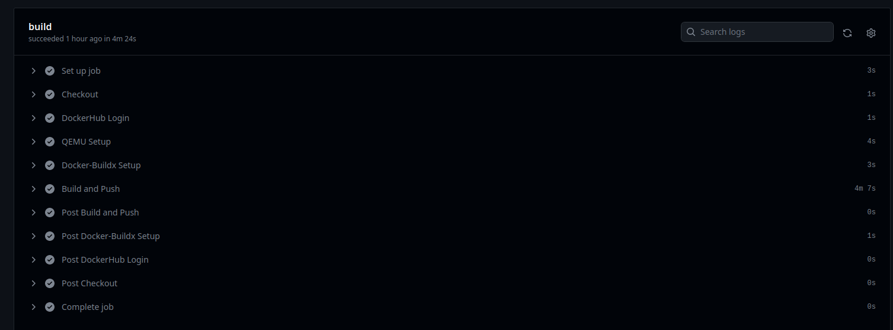

# Zadanie 2

Repozytorium zawiera [plik](.github/workflows/ip-address-app.yml) opisujący łańcuch Github Actions.

Uruchomi się on po wypchnięciu zmian na branchu main:

```yaml
on:
  push:
    branches:
    - "main"
```

Najpierw należy sklonować repozytorium i zalogować się na wskazane w ustawieniach repozytorium dane uwierzytelniania DockerHub.

```yaml
-
  name: Checkout
  uses: actions/checkout@v3
-
  name: DockerHub Login
  uses: docker/login-action@v2
  with:
    username: ${{ secrets.DOCKERHUB_USERNAME }}
    password: ${{ secrets.DOCKERHUB_SECRET }}
```

Następnie należy skonfigurować narzędzia docker-buildx i QEMU pod wieloplatformowy build.

```yaml
-
  name: QEMU Setup
  uses: docker/setup-qemu-action@v2
-
  name: Docker-Buildx Setup
  uses: docker/setup-buildx-action@v2
  with:
    platforms: linux/arm64/v8,linux/amd64
```

Ostatecznie obraz zostanie zbudowany i wypchnięty pod nazwą i tagiem `ip-address-app:latest`.

```yaml
-
  name: Build and Push
  uses: docker/build-push-action@v4
  with:
    platforms: linux/arm64/v8,linux/amd64
    context: ./ip-address-app
    push: true
    tags: ${{ secrets.DOCKERHUB_USERNAME }}/ip-address-app:latest
```

Link do zbudowanego obrazu w DockerHub: https://hub.docker.com/r/airgiorgio/ip-address-app/tags.

